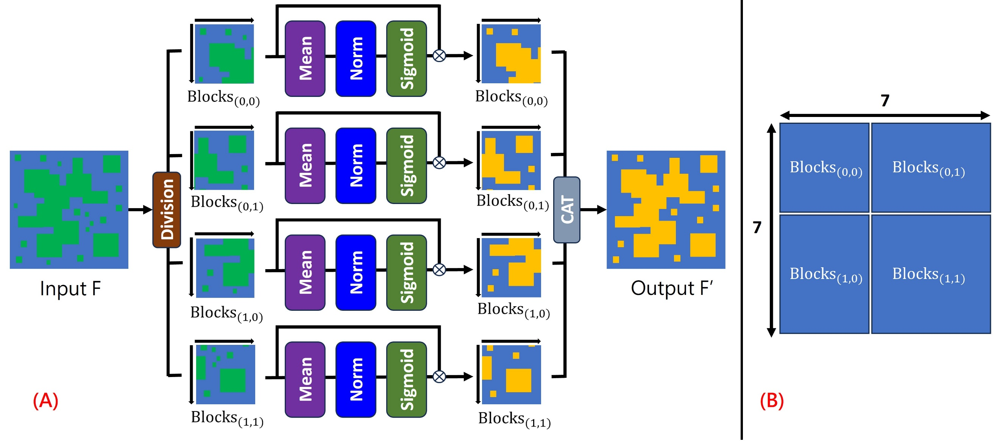

# SWS(SimAM With Slicing) Attention 
Attention Module for Small object detection

<div align="center">
    <a href="./">
        
    </a>
</div>

## Abstract
SimAM is a feature enhancement module without neural networks, offering the advantage of being lightweight and demonstrating potential in improving recognition performance. Based on this, we developed the new module SWS. The reason for incorporating the "slicing" operation is that when SimAM calculates the average pixel difference of the entire feature map, weighting may overlook the importance of small objects. Small objects occupy a relatively small proportion in aerial images and may be similar to background information compared to the overall average value, resulting in weaker weighting enhancement and consequently poorer enhancement ability of SimAM for small objects.

Therefore, we introduced a slicing operation. when the feature map is sliced into different blocks, larger objects, due to their prominent texture features, influence the average value of the block they are in, reducing the additional weighting they receive. After merging the feature maps, larger objects can still maintain high recognizability and may even be further enhanced. In contrast, the features of smaller objects differ more from the local average value, resulting in more weighting and enhanced small object features. In other words, the SWS module ensures that both large and small objects receive fair attention and enhancement.

## How to use
1.Add SWS.py to the models folder.
2.Add the following program to common.py and replace Conv in (your).yaml.
3.Add Conv_SWS to the parse_model function in yolo.py so that it can be used by .yaml
``` shell
from models.SWS import SimAMWithSlicing

class Conv_SWS(nn.Module):
    # Standard convolution
    def __init__(self, c1, c2, k=1, s=1, p=None, g=1, act=True):  # ch_in, ch_out, kernel, stride, padding, groups
        super(Conv_SWS, self).__init__()
        self.conv = nn.Conv2d(c1, c2, k, s, autopad(k, p), groups=g, bias=False)
        self.bn = nn.BatchNorm2d(c2)
        self.act = nn.SiLU() if act is True else (act if isinstance(act, nn.Module) else nn.Identity())
        self.att = SimAMWithSlicing(c2)

    def forward(self, x):
        return self.att(self.act(self.bn(self.conv(x))))

    def fuseforward(self, x):
        return self.att(self.act(self.conv(x)))
```

## VisDrone2019-testset-dev Evaluation
The experimental hardware for this study is an NVIDIA GeForce RTX 4070(12GB VRAM), implemented on Ubuntu 22.04, with CUDA version 11.7, Python version 3.9.13, and PyTorch version 2.0.1. The training parameters are as follows: img-size = 640*640, Epochs = 300, Train Batch = 2. When testing the model, NMS IOU = 0.45, and Test Batch = 32.

#### Detection base on PRB-FPN-ELAN(P5-layer .yaml #30) [(here)](https://github.com/pingyang1117/PRBNet_PyTorch)
|Model           |mAP50      |mAP50-95   |P    |R        |F1-score  |Prams |
|:----:          |:----:     |:---:      |:--: |:----:   |:---:     |:--:  |
|base            |39.5       |22.0       |49.9 |43.0     |46.2      |-     |
|SimAM           |39.4       |22.0       |51.2 |42.1     |46.2      |+460K |
|Coordinate      |39.6       |22.2       |49.7 |43.6     |46.5      |+560K |
|SE              |39.7       |22.2       |49.1 |43.8     |46.3      |+590K |
|CBAM            |39.7       |22.1       |53.0 |41.3     |46.4      |+590K |
|Biformer        |39.8       |22.2       |48.1 |44.6     |46.3      |+4.67M|
|SWS(Ours)       |39.9       |22.3       |53.3 |41.7     |46.8      |+460K |

## Reference 
SWS code is based on SimAM [here](https://github.com/ZjjConan/SimAM)

version 1.1.1 by LI,GUAN-YI 2024/07/30
